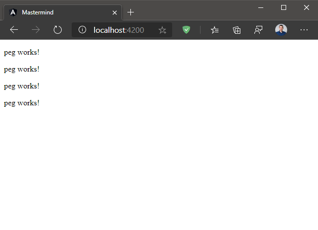
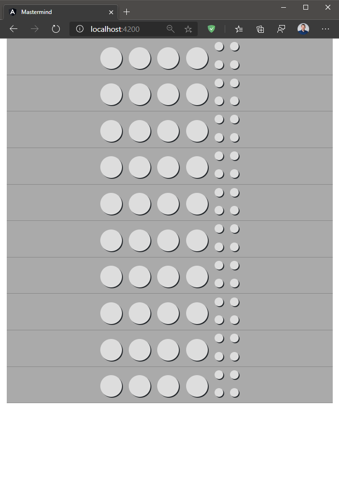
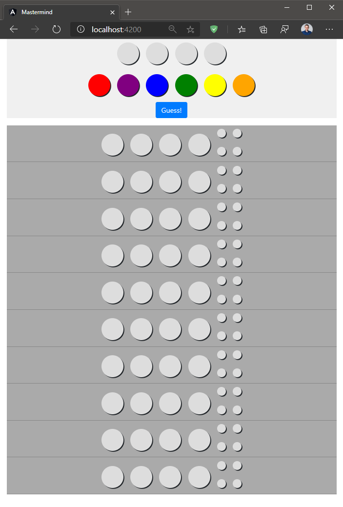

# Labor 05 - Angular bevezető

## Bevezetés

A labor folyamán a hallgatók jelen anyag segítségével önállóan végeznek feladatokat a webes technológiák gyakorlati megismerése érdekében.

Felhasznált technológiák és eszközök:

- webböngészők beépített hibakereső eszközei,
  - javasolt az [új Microsoft Edge](https://www.microsoft.com/en-us/edge) vagy a [Google Chrome](https://www.google.com/chrome/) böngésző használata,

- npm, a [NodeJS](https://nodejs.org/en/download/) csomagkezelője,
  - a laborhoz használható mind a Current, mint az LTS verzió, ha még nem telepítetted a NodeJS-t, akkor érdemes a Currentet (jelenleg 13.11.0) telepíteni,

- [Visual Studio Code](https://code.visualstudio.com/download) kódszerkesztő alkalmazás,
  - otthoni vagy egyéni munkavégzéshez használható bármilyen más kódszerkesztő vagy fejlesztőkörnyezet, de a környezet kapcsán felmerülő eltérésekről önállóan kell gondoskodni,
  - javasolt bővítmények:
    - [Angular Language Service](https://marketplace.visualstudio.com/items?itemName=Angular.ng-template)

Ahol nincs külön kifejezetten jelölve, a szoftverek legfrissebb stabil verzióit érdemes használni.

> *Figyelem!* A labor során számos, viszonylag nagyméretű (többszáz megabájt) függőségi csomag letöltésére lesz szükség!

### Az Angular-ről dióhéjban

Érdemes bevezetőként megnézni a hivatalos dokumentáció áttekintő oldalát: [https://angular.io/guide/architecture](https://angular.io/guide/architecture).


Az [Angular](https://angular.io/) egy komplett alkalmazásfejlesztési keretrendszer, aminek segítségével böngészőben futtatható, JavaScript alapú kliensalkalmazásokat tudunk írni. Az legfontosabb kulcsgondalatai:
- [Komponensek](https://angular.io/guide/architecture-components): az alkalmazás egymásba ágyazható elemei, amik egy adott felületi elem (oldal, menü, gomb stb.) kirajzolásáért és adatkötéséért felelősek.
- [Adatkötés](https://angular.io/guide/displaying-data): az adatkötés az adat felületre történő kirajzolását, a felületről beérkező (felhasználói) események kezelését, illetve ezek kombinációját (kétirányú adatkötés) jelenti.
- [Szolgáltatások](https://angular.io/guide/architecture-services): az alkalmazásunkban konkrét részfunkcionalitásért felelős osztályok, amelyeket [Dependency Injection](https://angular.io/guide/dependency-injection) támogat.
- [Modulok](https://angular.io/guide/architecture-modules): az alkalmazásunk összefüggő komponensei, szolgáltatásai (, direktívái, csővezetékei, routerei stb.), amelyek egységesen importálhatók más modulokba.
  - Maga az Angular is moduláris, a keretrendszer különböző funkcióit a megfelelő modulok, azokból komponensek, szolgáltatások (stb.) importálásával tudjuk elérni, ehhez a TypeScript (JavaScript) `import` kulcsszavát fogjuk használni, pl. `import { AppModule } from './app/app.module'; ` vagy `import { NgModule } from '@angular/core';`.
- [Sablonozónyelv (template syntax)](https://angular.io/guide/template-syntax): az Angular saját "nyelve", ami HTML és TypeScript elemeket, valamint néhány egyedi szintaktikai elemet tartalmaz.
- Sablonok: az Angular komponensek egy mögöttes, logikát és struktúrát leíró TypeScript fájlból és általában egy ehhez tartozó HTML fájlból tevődnek össze. A HTML fájl a mögöttes TypeScript fájlban definiált komponenshez fog adatot és eseményt kötni.
- [Angular CLI](https://angular.io/cli): az Angular Command Line Interface (CLI) egy [npm](https://www.npmjs.com/get-npm)-ből telepíthető parancssori eszköz, aminek segítségével összeállíthatjuk a kiinduló projektünket, új fájlokat, komponenseket hozhatunk létre előre összeállított formában.
- Dekorátorok: a TypeScript [dekorátorai](https://www.typescriptlang.org/docs/handbook/decorators.html#class-decorators) segítségével az Angular osztályainkhoz, tulajdonságokhoz metaadatokat rendelünk az alábbi formában:
``` TS
import { Component } from '@angular/core';

@Component({
  selector: 'app-root',
  templateUrl: './app.component.html',
  styleUrls: ['./app.component.scss']
})
export class AppComponent {
  /* ... */
}

```

# A feladat

A feladat a klasszikus [MasterMind](https://en.wikipedia.org/wiki/Mastermind_(board_game)) táblajáték kliensalkalmazás elkészítése lesz. Ennek sok variánsa létezik, a játék szabályai nálunk az alábbiak lesznek:
- A "gép" (a kódmester) sorsol egy véletlenszerű, 4 hosszúságú sorozatot az alábbi 6 színű golyóból: piros, lila, kék, zöld, sárga, narancs.
  - Ugyanaz a szín többször is szerepelhet a sorrendben, pl.: kék, sárga, sárga, kék, zöld, lila.
- A játékos (a kódfejtő) megpróbálja megtippelni a kódmester által kisorsolt színsorozatot.
  - Minden tippre a játékos visszajelzést kap: ahány helyen helyes színű golyó van, annyi fekete színű jelzést kap; ezen felül ahány szín helyes, de rossz helyen van a sorrendben, annyi fehér színű jelzést kap.
- A játékosnak 10 körön belül ki kell találnia az eredeti sorrendet.

A labor során a játék kezdőképernyőjét készítjük el, a következő alkalommal innen folytatjuk, ezért a végállapotot érdemes elmenteni!

# Kiindulás

A gépre telepítve kell lennie az Angular CLI eszköznek. Az Angular CLI egy npm parancssori parancs, a NodeJS telepítésekor a globálisan telepített eszközök így bekerülnek a PATH változóba, így parancssorból egyszerűen az `ng` parancs futtatásával érhető el, ezért javasolt globálisan telepíteni az eszközt. Nyissunk egy üres munkamappát VS Code-ban, majd a Terminalban (Ctrl+ö) adjuk ki az alábbi parancsot:

> `npm install -g @angular/cli`

A telepítő felteheti az alábbi kérdést, erre válaszoljunk `n`-nel:
> Would you like to share anonymous usage data with the Angular Team at Google under Google’s Privacy Policy at https://policies.google.com/privacy? For more details and how to change this setting, see http://angular.io/analytics.

Ezután az aktuális mappánkban adjuk ki az alábbi parancsot, ami egy új, üres projektet hoz nekünk létre:

> `ng new mastermind --prefix=mm --skip-tests=true --routing=false --style=scss --inline-style=false --inline-template=false`

A parancshoz kapcsolódó kapcsolók értelmezéséhez a [dokumentáció](https://angular.io/cli/new) ad segítséget. Kiemelendő a `prefix` kapcsoló, amivel az automatikusan generált komponensek CSS 
selectorainak prefixét adjuk meg. Ez alapértelmezetten az `app` értéket veszi fel, tehát a KutyaComponent pl. az `app-kutya` selectorral lenne elérhető, ehelyett ezt a paraméter megadásával `mm-kutya`-ként fogjuk tudni elérni.

> Ha a parancs nem fut le, mert nem találja az `ng` parancsot, ellenőzizzük, hogy a rendszer PATH környezeti változójában megtalálható-e az alábbi sor, és ha nem, **vegyük fel, majd indítsuk újra a VS Code-ot**, hogy beolvassa az új környezeti változókat: `%APPDATA%/npm`!
>
> 
> 

Ha létrehoztuk a kiinduló projektet, el tudjuk indítani azt az alábbi paranccsal (mappát kell előtte váltanunk az Angular projektre, azaz `cd mastermind`):

> `ng serve`

Ezzel a paranccsal egy **fejlesztésre használható** szerver szolgálja ki az Angular alkalmazásunkat. Figyeli a háttérben a változásokat, szükség esetén a megfelelő részeket újrafordítja, és frissíti a böngésző megfelelő részeit (nem a teljes oldalt).

Kis idő után az alábbit látjuk:
```
Date: 2020-03-22T14:45:07.219Z - Hash: c285db261424f94374a8 - Time: 13135ms
** Angular Live Development Server is listening on localhost:4200, open your browser on http://localhost:4200/ **
: Compiled successfully.

Date: 2020-03-22T14:45:07.964Z - Hash: c285db261424f94374a8
5 unchanged chunks

Time: 380ms
: Compiled successfully.
```

Nyissuk meg tehát a böngészőt a <a href="http://localhost:4200" target="_blank">`http://localhost:4200`</a>-on!

Az `ng serve` parancsot hagyjuk a háttérben futni. Ha új parancsokat kell végrehajtanunk, nyissunk egy új terminált a `Ctrl+Shift+ö` billentyűkombinációval!


A kiinduló projekt önmagában eléggé interaktív. Vizsgáljuk meg a létrejött projekt tartalmát (a számunkra jelenleg relevánsak vannak itt csak kiemelve):
- **node_modules**: a számos függőség, ami a kiinduló projekthez kell (maga az Angular és függőségei)
- **angular.json**: az alkalmazásunk Angular konfigurációja
- **package.json**: az alkalmazásunk függőségeinek listája, ide tudjuk felvenni az npm csomagjainkat függőségként (vagy az `npm i [függőség_neve]` paranccsal ebbe a fájlba kerülnek be)
- **tsconfig.json**: az alkalmazásunk TypeScript konfigurációja
- **src**: az alkalmazásunk teljes önálló forráskódja, ebben fogunk dolgozni
  - **index.html**:
    - a kiinduló fájlunk, gyakorlatilag semmi érdemi nem található benne, az Angular build fogja kitölteni a megfelelő `<script>` és egyéb hivatkozásokkal
    - a törzsben található egy `<mm-root>` nevű elem, ami az alkalmazásunk gyökéreleme, erről még lesz szó később
  - **main.ts**: az alkalmazás belépési pontja, ez állítja össze magát az alkalmazást és indítja el
  - **polyfills.ts**: itt adhatjuk meg a különböző támogatandó böngészőkhöz szükséges [polyfill](https://en.wikipedia.org/wiki/Polyfill_(programming))-eket
  - **styles.scss**: a globális stíluslapunk
    - jelenleg ez a fájl üres, ide írhatjuk a globális CSS(/SCSS) szabályainkat
    - Angular-ben a komponenseknek lehet saját stíluslapjuk is, ami csak az adott komponensen fog érvényesülni, ezt is fogjuk látni később
  - **assets**: ebben a mappában tárolhatjuk a statikus tartalmainkat (pl. képek)
  - **environments**: különböző környezeteinknek (pl. dev, teszt, prod) hozhatunk létre egyedi konfigurációkat
  - **app**: az alkalmazásunk lényegi forráskódja
    - **app-routing.module.ts**: az alkalmazás útvonalválasztási logikáját írja le (milyen URL-re milyen komponens töltődjön be), jelenleg üres (bármilyen URL-re a root URL, így az app-root töltődik csak be)
    - **app.module.ts**: az alkalmazásunk modulja, ami összefogja a teljes alkalmazásban definiált elemeinket (komponensek, direktívák, szolgáltatások)
    - **app.component**
      - **.ts**: a komponensünk TypeScript forrása, egy egyszerű TypeScript osztály, ami dekorálva van az Angular `@Component()` dekorátorával, így tudatjuk az Angular-rel, hogy az osztályunk egy komponens
      - **.html**: a komponenshez tartozó HTML kód, itt tudunk adatkötni a TypeScript osztályban definiált tulajdonságokhoz
      - **.scss**: a komponenshez tartozó, csak a komponens *scope*-jára vonatkozó stíluslap
- a kihagyott részek jellemzően a unit- és integrációs tesztelést segítik (pl. az e2e mappa, test.ts fájl, karma.conf.js, tsconfig.spec.json)

## Specifikáció

A kezdőoldalon maga a játék jelenjen meg. A játéktéren egy rács elrendezésben jelenik meg 10 sor, minden sorban 4 üres kör, ezek jelzik majd a tippelt színeket, ezek mellett pedig 4 kisebb üres kör, ahol a fekete/fehér jelzők fognak szerepelni.

A sorok fölött az aktuális tippünket fogjuk összeállítani, így megjelenik ott is 4 üres kör. Ez alatt megjelenik a 6 különböző színű golyó: piros, lila, kék, zöld, sárga, narancs. Az egyes golyókra kattintva az bekerül a balról következő üres helyre (ha van még). Ha a tippünkben egy golyóra kattintunk, akkor az kikerül a sorból, az utána következő elemek pedig balra csúsznak eggyel. Ha minden hely megtelt, aktiválódik egy gomb, amivel el tudjuk küldeni a tippünket.

Miután elküldjük a tippet, a tippünk bekerül a 10 sorból az első üres sorba, és megjelenik mellette, hogy hány golyó van megfelelő helyen (fekete jelző) és hány van rossz helyen (fehér jelző).

Ha a tippünk talált (4 fekete jelző), a játék jelzi, hogy nyertünk, és új játékot kezdhetünk. Ha a 10. próbálkozás sem talál, akkor veszítettünk, és új játékot kezdhetünk. Amikor a játéknak vége van, felfedésre kerül, hogy mi volt az eredetileg sorsolt sorrend.

## Bootstrap

Adjuk hozzá a Bootstrap-et az alkalmazásunkhoz, hogy könnyen stílusozható legyen, és tudjuk hasznosítani a Bootstrap adta komponenseket. A Bootstrapet nem a szokásos módon adjuk a projektünkhöz most, ugyanis az Angular alapú működéshez specifikus integrációs csomag készült [`ng-bootstrap`](https://ng-bootstrap.github.io/#/getting-started) néven. Ez egyedileg lett implementálva a Bootstrap komponenseihez az Angular lehetőségeinek megfelelően, nincs is JQuery-től, Popper.js-től való függőségünk. Futtassuk le a `mastermind` projekt mappájában (ahol a `package.json` található) az alábbi parancsokat:
> `npm install bootstrap`
>
> `npm install @ng-bootstrap/ng-bootstrap`
>
> `ng add @angular/localize`

Az `angular.json` fájlban, a `projects\mastermind\architect\build\options` elemben egészítsük ki a styles értéket:
``` JSON
"styles": [
  "node_modules/bootstrap/dist/css/bootstrap.min.css",
  "src/styles.scss"
],
```

Ezt követően újra kell indítanunk az `ng serve` szervert.

Az `ng-bootstrap` által definiált komponenseket, direktívákat, szolgáltatásokat az Angular alkalmazásunk moduljához kell rendelni (különben nem fogja ismerni az alkalmazásunk). A `mastermind\src\app\app.module.ts` fájlhoz adjuk hozzá a függőséget az alábbi módon:

``` TS
// import ...

import { NgbModule } from '@ng-bootstrap/ng-bootstrap';

@NgModule({
  // ...
  imports: [
    BrowserModule,
    NgbModule // <<< +++
  ],
  // ...
})
export class AppModule { }

```

Ezzel meg is volnánk, az alkalmazásunkban használhatjuk a szokásos Bootstrap elemeket, de fontos megjegyezni, hogy ez nem feltétlenül (/kizárólag) a szokásos Bootstrap osztályok elemekre aggatásával történik. A [hivatalos dokumentáció](https://ng-bootstrap.github.io/#/getting-started) az irányadó.

## Peg komponens

Az oldalunkon tehát meg kell jelennie 10 sornak, benne 4 nagyobb és 4 kisebb "golyóval".

Készítsük el a nagyobb golyókat és a kisebb golyókat reprezentáló `mm-peg` komponenst!

Hozzunk létre egy új komponenst az Angular CLI segítségével:
> `ng generate component peg`

A fentinek a rövidebb formája: [`ng g c peg`](https://angular.io/cli).

A parancs 3 fájlt hoz nekünk létre a `mastermind\src\app\peg` mappában: 
- a komponens stíluslapját (.scss) - ez jelenleg üres,
- a komponens template-jét (.html):
``` HTML
<p>peg works!</p>
```
- a komponens kódját (.ts):
``` TS
import { Component, OnInit } from '@angular/core';

@Component({
  selector: 'mm-peg',
  templateUrl: './peg.component.html',
  styleUrls: ['./peg.component.scss']
})
export class PegComponent implements OnInit {

  constructor() { }

  ngOnInit(): void {
  }

}

```

Az `app.component.html` kódját cseréljük le az alábbira:
``` HTML
<mm-peg></mm-peg>
<mm-peg></mm-peg>
<mm-peg></mm-peg>
<mm-peg></mm-peg>
```

Vegyük észre, hogy a kód írása közben kapunk IntelliSense-t a komponens nevéhez. Ha mégsem kapnánk IntelliSense-t, ellenőrizzük, hogy telepítettük-e a szükséges [Angular Language Service](https://marketplace.visualstudio.com/items?itemName=Angular.ng-template) bővítményt, indítsuk újra a VS Code-ot, és indítsuk újra az `ng serve`-öt!



A komponensünket tehát úgy példányosítottuk, hogy a komponenshez tartozó **CSS selector**nak megfelelő elemet elhelyeztük a HTML-ben.

Vegyük észre továbbá, hogy a komponensünk megvalósítja az ún. OnInit interfészt, ez később az [Angular komponens/direktíva életciklus](https://angular.io/guide/lifecycle-hooks) során lehet még hasznos.

Hozzuk létre a színeket reprezentáló típust az `src\app\models\peg-color.ts` fájlba:
``` TS
export type PegColor = 'red' | 'purple' | 'blue' | 'green' | 'yellow' | 'orange' | 'black' | 'white' | 'unset';
```

A Peg kétféle lehet: code vagy key, ennek is hozzunk létre egy típust az `src\app\models\peg-type.ts` fájlba:
``` TS
export type PegType = 'code' | 'key';
```

A PegComponent-be vegyünk fel egy adatkötött tulajdonságot és két számított, lekérdezhető értéket:

``` TS
export class PegComponent implements OnInit {

  @Input() // Az Input dekorátort importálnunk kell a jelenlegi scope-ba. Ehhez használhatjuk a VS Code segítségét (Ctrl+. a kurzort a hibára helyezve) vagy fentre beírhatjuk: import { Input } from '@angular/core';
  color: PegColor; // Hasonlóképp a PegColor-ra is, csak itt a lokális '../models/peg-color'-ból importálunk.

  @Input()
  type: PegType;

  get colorChar() {
    return (this.color ?? "X")[0].toUpperCase();
  }

  get colorLower() {
    return this.color ?? "unset"; 
  }
  // ...
}
```

Szóval a komponensünknek, ami egy golyót fog reprezentálni, lesz egy színe és egy típusa, amit ő kívülről, a szülőtől fog várni paraméterként. A szín első betűjét nagybetűsítve le tudjuk kérdezni, vagy ha nincs megadva szín, egy X-et adunk vissza helyette.

A ?? operátor C#-ból ismerős lehet, TypeScriptben is használatos. A ?? a bal oldalt adja vissza, ha az nem `undefined` vagy `null`, a jobb oldalt, ha igen.

Módosítsuk a code-peg.component.html tartalmát az alábbira:
``` HTML
<div class="{{colorLower}}">{{colorChar}}</div>
```

A fenti szintaxis az egyirányú adatkötést jelenti. A `color` és `colorChar` a komponensük scope-jában (`this`-én) elérhető változók (tulajdonságok), amiket a felület irányába továbbítunk. Amikor ezek az értékek változnak, az Angular megfelelően újrarendereli nekünk az elemeket!

A fentivel teljes mértékben ekvivalens az alábbi szintaxis is, amit később fogunk használni:

``` HTML
<div [class]="colorLower">{{colorChar}}</div>
```

Ezzel a szintaxissal szokás attribútum értékeket kötni, ill. ugyanezzel a módszerrel adhatunk át `@Input()` paramétert egy komponensnek vagy direktívának is.

Cseréljük le a HTML-t az alábbira:

``` HTML
<div class="peg peg-{{colorLower}} peg-{{type}}">{{colorChar}}</div>
```

Stílusozzuk meg az elemet! A komponenshez tartozó stíluslap csak a komponens hatáskörében fog érvényre jutni, tehát azon kívül a megfelelő selectorral rendelkező elemekre sem. Az `src\app\peg\peg.component.scss` tartalma legyen az alábbi:

``` SCSS
.peg {
    border: 1 px solid grey;
    margin: 8px;
    box-shadow: 2px 2px;
}

.peg.peg-code {
    height: 50px;
    width: 50px;
    border-radius: 25px;
}

.peg.peg-key {
    height: 20px;
    width: 20px;
    border-radius: 10px;
}

@mixin peg-bg-color($color){
    .peg.peg-#{$color} {
        background: #{$color};
    }
}

@each $color in 'red', 'purple', 'blue', 'green', 'yellow', 'orange', 'black', 'white' {
    @include peg-bg-color($color);
}

.peg.peg-unset {
    background: #ddd;
}
```

Cseréljük le az app-component.html tartalmát:

```HTML
<mm-peg [color]="'red'"></mm-peg>
<mm-peg [color]="'green'"></mm-peg>
<mm-peg [color]="'blue'"></mm-peg>
<mm-peg [color]="'orange'"></mm-peg>
```

Ha most megnézzük, már haladást láthatunk:


A DOM Explorerben láthatjuk, hogy nem jutott érvényre sem a `.peg-key`, sem a `.peg-code`, ugyanis ennek nem adtunk értéket, így egy `.peg-` osztály kerül az elemre.

Észrevehetjük még, hogy az elem egy fura attribútumot kapott (pl. `_ngcontent-dca-c97`). Ennek oka, hogy a CSS szabályunk valójában módosításra került úgy, hogy magába foglalja ezt a generált attribútumot. Ezért nem fut le tehát ez a selector más elemekre.

Töltsük ki az elem típusát is:
```HTML
<mm-peg [color]="'red'" [type]="'code'"></mm-peg>
<mm-peg [color]="'green'" [type]="'code'"></mm-peg>
<mm-peg [color]="'black'" [type]="'key'"></mm-peg>
<mm-peg [color]="'black'" [type]="'key'"></mm-peg>
<mm-peg [color]="'white'" [type]="'key'"></mm-peg>
<mm-peg [color]="'white'" [type]="'key'"></mm-peg>
```


Alakul, most már látjuk, mit szeretnénk elérni. Néhány apróságot tegyünk rendbe:

``` HTML
<div class="peg peg-{{colorLower}} peg-{{type}}"></div>
```

``` SCSS
.peg {
    box-shadow: 2px 2px;
    display: inline-block; // <<< +++
}

// ...
```

A `peg.component.ts`-ből törölhetjük a `getColorChar()` függvényt, nem lesz rá szükség.


## Sor definiálása

Egy sorban tehát meg kell jelennie 4 színes golyónak (vagy helyőrzőnek), mellette 4 jelzőnek. Tíz sornak kell összesen megjelennie.

Vegyünk fel egy osztályt, ami az egyes tippeket fogja reprezentálni az `src\app\models.guess` fájlba:

`src\app\models\guess.ts`
```TS
import { PegColor } from './peg-color';

export class Guess {
    constructor(
        public colors: PegColor[], // A tippelt színeket jelző tömb, benne pontosan 4 elemmel.
        public keys: PegColor[]) { // A tippek helyességét jelző tömb, benne pontosan 4 elemmel.
    }
}
```

Az osztályunk 4 színt fog tárolni (ami tipp érkezett), illetve 4 másikat, ami a visszajelzéseket mutatja majd.

Egészítsük ki az `AppComponent` kódját az alábbiakkal:

`src\app\app.component.ts`:
```TS
import { Component } from '@angular/core';
import { Guess } from './models/guess';
import { PegColor } from './models/peg-color';

@Component({
  selector: 'mm-root',
  templateUrl: './app.component.html',
  styleUrls: ['./app.component.scss']
})
export class AppComponent {
  guesses: Guess[];

  constructor() {
    this.initGame();
  }

  initGame() {
    this.guesses = [];
    for (let _ of Array(10).keys())
      this.guesses.push(new Guess(['unset', 'unset','unset','unset'], ['unset', 'unset','unset','unset']));

    console.log(this.guesses);
  }
}
```

Az `AppComponent` az `initGame()` függvényben, amit konstruktorból is meghív, létrehozza a 10 "üres" tippet (`guesses`)

`src\app\app.component.html`:
```HTML
<main class="container-fluid">
    <section class="guesses-container">
        <div *ngFor="let guess of guesses" class="guess-row text-center">
            <mm-peg *ngFor="let color of guess.colors" [type]="'code'" [color]="color"></mm-peg>
            <div class="keys-container">
                <mm-peg *ngFor="let key of guess.keys" [type]="'key'" [color]="key"></mm-peg>
            </div>
        </div>
    </section>
</main>
```

Az oldal template-jében az `*ngFor` attribútum által jelzett `NgFor` direktívával bejárást végzünk a `guesses`, azon belül pedig a `colors` és `keys` tömbökön, és mindegyiknek létrehozzuk a szükséges HTML elemeket.

`src\app\app.component.scss`:
```SCSS
main {
    min-width: 450px;
}

.guesses-container {
    background: #aaa;
}

.guess-row {
    border-bottom: 1px solid rgba(100, 100, 100, 0.6)
}
```



## Tipp összeállítás

A sorok fölött a jelenlegi tippünk összeállítása fog látszani. Ez alatt a 6 lehetséges szín fog megjelenni, amire kattintva össze tudjuk állítani a tippet, valamint egy gomb, amivel el tudjuk küldeni a tippünket.

Egészítsük ki az `app.component.ts` fájlt:
```TS
export class AppComponent {
  guesses: Guess[];
  currentGuess: PegColor[];
  possibleValues: PegColor[] = ['red', 'purple', 'blue', 'green', 'yellow', 'orange'];

  constructor() {
    this.initGame();
  }

  initGame() {
    this.guesses = [];
    this.currentGuess = [];
    for (let _ of Array(4).keys())
      this.currentGuess.push('unset');
    for (let _ of Array(10).keys())
      this.guesses.push(new Guess(['unset', 'unset','unset','unset'], ['unset', 'unset','unset','unset']));
    console.log(this.guesses);
  }
}
```

Az inicializáláskor kitöltjük a jelenlegi tippünket reprezentáló 4 színből álló tömböt (`currentGuess`), ezen felül a lehetséges értékek listáját eltároljuk a `possibleValues` tömbben.

Egészítsük ki a HTML-t, hogy megjelenítse az elemeket:

`src\app\app.component.html`:
```HTML
<main class="container-fluid">
    <section class="current-guess-container text-center mb-3">
        <div class="current-guess-row">
            <mm-peg *ngFor="let color of currentGuess" [type]="'code'" [color]="color"></mm-peg>
        </div>
        <div class="colorpicker">
            <mm-peg *ngFor="let color of possibleValues" [type]="'code'" [color]="color"></mm-peg>
        </div>
        <button class="btn btn-primary">Guess!</button>
    </section>
    <section class="guesses-container">
      <!-- ... -->
    </section>
</main>
```

Igazítsuk hozzá a stílusokat:

`src\app\app.component.scss`:
```SCSS
// ...

.current-guess-container {
    background: #f0f0f0
}
```

A kezdőoldallal megvolnánk.



 Az adatkötést egy irányban gyakoroltuk, a modell (komponens) felől a nézet (template) irányába. A következő alkalommal bekötjük az eseménykezelőket, és megírjuk a szükséges logikákat, hogy a játék játszható legyen.
